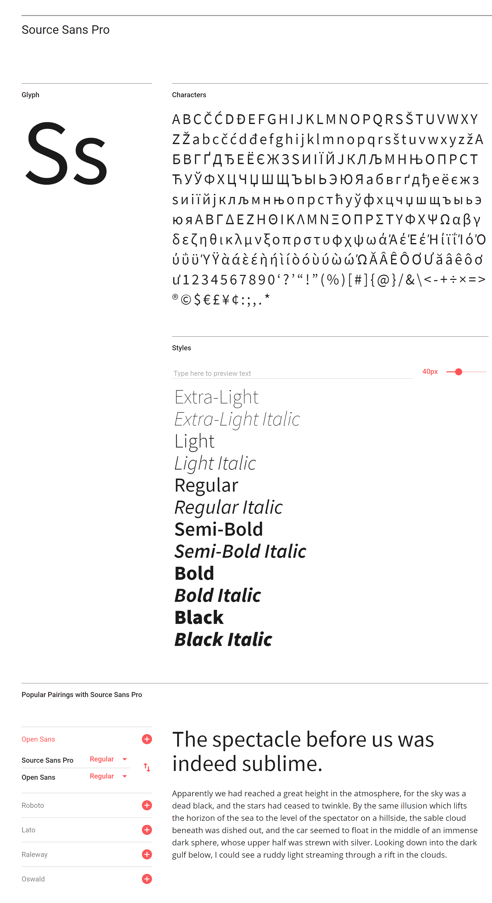
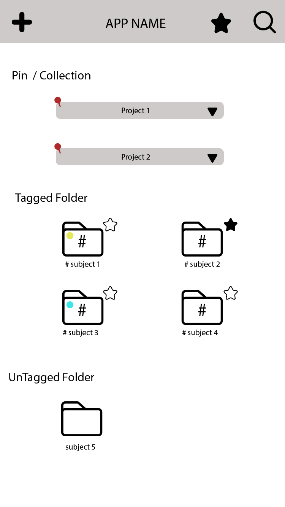
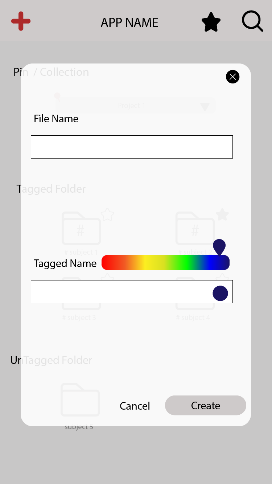
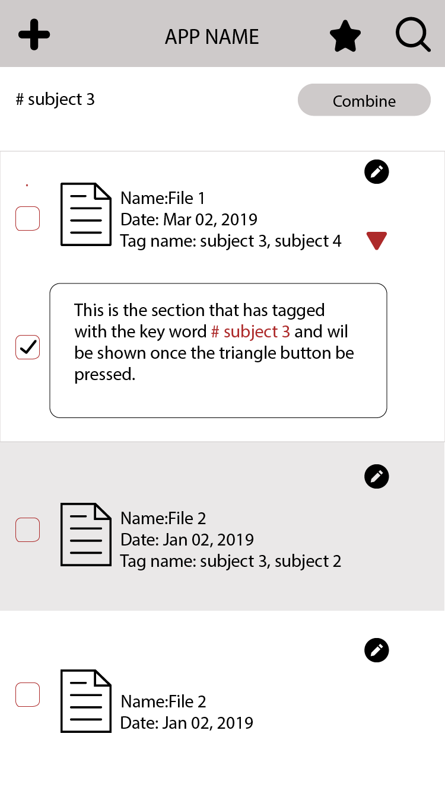
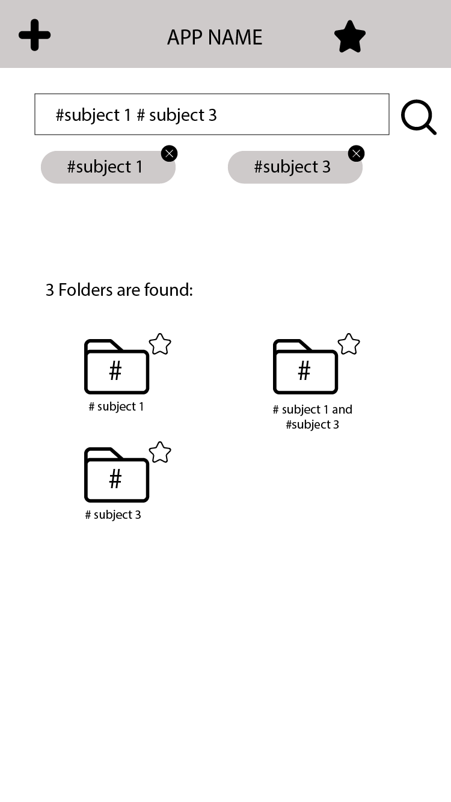

# Central Design Notes

## Markdown Guides
If you need help with writing Github-flavoured markdown, check out these guides:
- <https://github.com/adam-p/markdown-here/wiki/Markdown-Cheatsheet>
- <https://guides.github.com/features/mastering-markdown/>
- <https://agea.github.io/tutorial.md/>

----

## Colours & Fonts
An example of colours and fonts (delete or replace)

### Colours
<https://coolors.co/0c0a0a-3f434e-dddadf-68a01b-3a721e>
-  `#ADD8E6`
-  `#FFFFFF`
-  `#DDDADF`
-  `#0C0A0A`

### Fonts
<https://fonts.google.com/?selection.family=DM+Serif+Display|Open+Sans:400,400i,700,700i>
<https://fonts.google.com/specimen/Source+Sans+Pro?selection.family=Source+Sans+Pro>;

1. DM Serif Display

   - Used for:
     - Headings
     - Accent text
          - Default text (paragraphs, lists, etc)
     - Form elements

----

## Wireframes & Annotation/Notes
Images and notes go here

